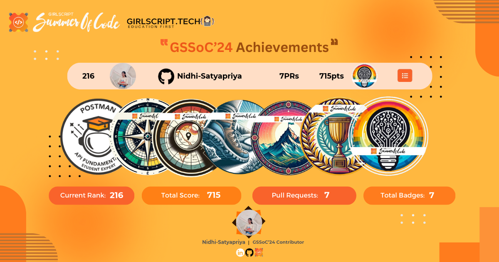

<h1 align="center">Hi 👋, I'm Nidhi Satyapriya</h1>
<h3 align="center"> ML/ AI Practitioner | MERN Developer | Java/ C++ Programmer | Research & Open-Source | Tech & Social Leads </h3>

  

---

### 🚀 About Me

I am a Machine Learning-focused developer passionate about building intelligent solutions. 

I observe closely — when I spot a real-world problem or an emerging trend, it goes from my mental processor to my hand scheduler, and I start building a scalable, and optimized solution. 

- 🌱 Currently grinding: **Core ML/ DL, LLMs, Agentic AI, MERN, FastAPI, CI/CD**
- 👨‍💻 Know me more: [nidhi-satyapriya.github.io/Portfolio](https://nidhi-satyapriya.github.io/Portfolio/)
- 📫 Reach out at: **satyapriyanidhi@gmail.com**

---

### Experience & Highlights
- **Project Intern @ IIT (BHU) Varanasi**- Contributing novel ML models to a NASF funded project at IITBHU.
- **SIH '24 Finalist**- Top 2 teams out of 200+ nationwide submissions.
- **Project Admin @SSOC'25**- building my idea leveraging skills and implementations of contributors across dev and ml domains.
- **Top Contributor** at **GSSoC'24**- ranked in top project contributors
- **Walmart CodeHers 2025 Finalist**- making to 0.6% of top women coders in India.
- **Kaggle Active Learner** with growing contributions to competitions and datasets
- **Hands-on** with Agentic AI, YOLO, MERN, and building efficient ML inference pipelines through **internships and independent projects**.
- **GenSec at EBSB Board**- Quiet on socials, pro-active in making social impact. 
- On my redemption arc to be the top minds in **software development, and programming.**

---

###  Tech Stack & Tools

#### 👩‍💻 Languages  
  

#### 🧱 Frameworks & Libraries  

#### ☁️ Cloud & Version Control  

#### 📦 Databases  

#### 🤖 ML / AI / GenAI  

#### 🛠 Tools & Others  

---

###  GitHub Stats

  
  
  

---

###  GitHub Trophies

  

---

### Contribution Graph

  

---

### Badges & Stats

#### 🛠️ GSSoC'24 Stats

#### 🎯 Kaggle Badges

---

### 🌐 Connect With Me

  
  
  
  
  

---

  

